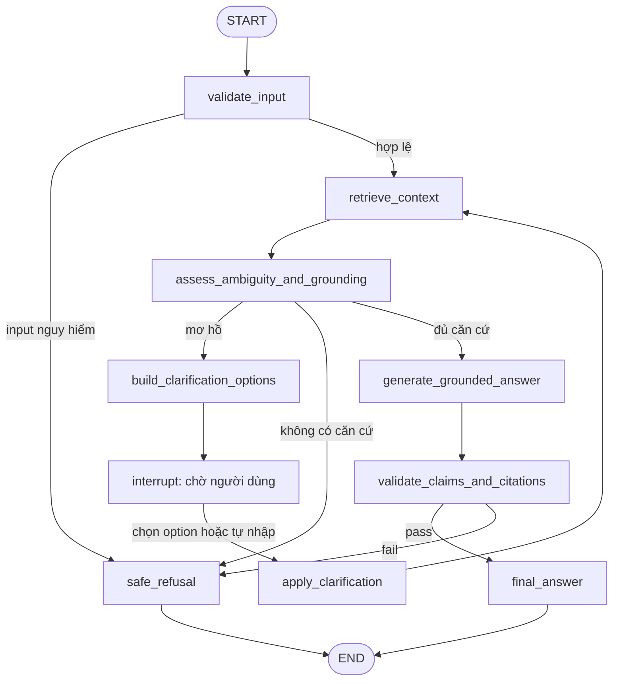

# A1 Draft — LangGraph cho Tutor có căn cứ và hỏi lại khi mơ hồ

> Trạng thái: bản thiết kế trước CP1/CP2. Chưa phải quality bar đã khóa.

## Lát cắt

Một học viên đang đọc một bài cụ thể trên VLearn và đặt câu hỏi; AI quyết định tài liệu hiện có đã đủ căn cứ để trả lời hay chưa; nếu đủ thì trả lời ngắn kèm mã trang/đoạn, nếu mơ hồ thì đưa lựa chọn hoặc cho nhập bổ sung, nếu không đủ thì báo ngoài phạm vi.

## Nguyên tắc quyết định

Phần sinh câu chữ vẫn mang tính xác suất. Các cổng an toàn phải do code kiểm soát:

1. Chỉ retrieve trong bài học đang mở.
2. Mỗi chunk có `source_id`, trang/đoạn và nội dung gốc.
3. Câu hỏi thiếu đối tượng hoặc retrieval có nhiều intent gần nhau phải đi qua clarification.
4. Không đủ nguồn thì không được chạy nhánh trả lời.
5. Citation không thuộc tập chunk đã retrieve thì output bị guard chặn.
6. Clarification tối đa hai vòng; vẫn mơ hồ thì báo giới hạn và chuyển TA.

## Sơ đồ LangGraph



## State

```python
class TutorState(TypedDict, total=False):
    thread_id: str
    lecture_id: str
    question: str
    selected_text: str | None
    retrieved_chunks: list[SourceChunk]
    retrieval_score: float
    score_margin: float
    ambiguity_reason: str | None
    clarification_round: int
    clarification_options: list[ClarificationOption]
    clarification_answer: str | None
    route: Literal["answer", "clarify", "refuse"]
    draft_answer: str | None
    citations: list[str]
    final_answer: str | None
    error: str | None
```

## Khi nào coi là mơ hồ

Điểm số dưới đây phải được hiệu chỉnh bằng golden set; chưa khóa ở CP1:

- Câu quá ngắn hoặc chỉ có đại từ: “cái này”, “cgi”, “đáp án gì”.
- Không chỉ ra concept/câu quiz/đoạn đang nói tới.
- Top-1 retrieval thấp.
- Top-1 và top-2 gần nhau, cho thấy hai cách hiểu đều hợp lý.
- Bộ phân loại intent trả `needs_clarification=true` theo JSON schema.
- Lịch sử hiện tại không đủ để nối tham chiếu “nó”, “đoạn trên”, “câu đó”.

Không dùng riêng độ dài câu để kết luận; câu ngắn như “BM25 là gì?” vẫn rõ.

## Option contract

Option phải lấy từ heading/chunk thật hoặc trạng thái UI hiện có; không để LLM tự bịa lựa chọn.

```json
{
  "status": "needs_clarification",
  "thread_id": "thread-123",
  "prompt": "Anh đang hỏi payload trong ngữ cảnh nào?",
  "reason": "Hai concept có điểm retrieval gần nhau",
  "options": [
    {
      "id": "tool-payload",
      "label": "Payload trong Tool Calling",
      "expanded_query": "Payload trong lời gọi tool gồm những trường nào?",
      "source_refs": ["D03:tool-calling"]
    },
    {
      "id": "api-payload",
      "label": "Payload của API request/response",
      "expanded_query": "Payload của API request/response là gì?",
      "source_refs": ["D03:api"]
    }
  ],
  "allow_custom": true
}
```

UI luôn có tối đa ba option và nút **“Khác — tự nhập”**.

## Node clarification dùng interrupt

```python
from langgraph.types import interrupt

def wait_for_clarification(state: TutorState) -> dict:
    payload = {
        "type": "clarification",
        "prompt": state["ambiguity_reason"],
        "options": state["clarification_options"],
        "allow_custom": True,
    }
    response = interrupt(payload)
    return {
        "clarification_answer": response,
        "clarification_round": state.get("clarification_round", 0) + 1,
    }
```

Graph bắt buộc có checkpointer. Client resume bằng cùng `thread_id`:

```python
from langgraph.types import Command

result = graph.invoke(
    Command(resume={"option_id": "tool-payload"}),
    config={"configurable": {"thread_id": thread_id}},
)
```

## Luồng UI

### Chọn option

1. Tutor hiện câu hỏi làm rõ.
2. Người dùng chọn một chip.
3. Chip được khóa và hiện trạng thái “Đã chọn”.
4. Frontend gửi `option_id` cùng `thread_id`.
5. Graph resume, ghép `expanded_query`, retrieve lại và trả lời.

### Tự nhập

1. Người dùng chọn “Khác — tự nhập”.
2. Hiện textarea và nút Tiếp tục.
3. Input rỗng hoặc dưới ba ký tự không được gửi.
4. Graph resume với `custom_text`.
5. Nếu vẫn mơ hồ sau vòng hai, Tutor báo chưa đủ thông tin và chuyển TA.

### Correction

1. Người dùng bấm “Không phải ý này”.
2. Câu trả lời hiện tại bị thu hồi khỏi trạng thái hợp lệ.
3. Graph quay lại clarification với các option khác.
4. Feedback được lưu cùng turn ID để bổ sung golden set.

## Ví dụ

### “cgi”

- Payload trong Tool Calling.
- Payload của API request/response.
- Payload cần xác nhận trước khi thực hiện action.
- Khác — tự nhập.

### “đáp án gì”

- Câu top-p = 0,75.
- Câu phân loại Discriminative/Generative/Agentic.
- Câu sắp xếp vòng ReAct.
- Khác — tự nhập.

## Definition of Done cho CP2

- [ ] Mơ hồ thì hiện tối đa ba lựa chọn + custom input.
- [ ] Option có nguồn từ context/heading thật.
- [ ] Chọn option hoặc nhập custom đều đi tiếp được.
- [ ] Có trạng thái loading, selected, validation error và correction.
- [ ] No-grounding không tạo câu trả lời giả.
- [ ] Flow bấm được từ câu hỏi đến final/refusal.
- [ ] Ghi rõ phần CP2 đang mock; CP3 mới gắn AI thật.
