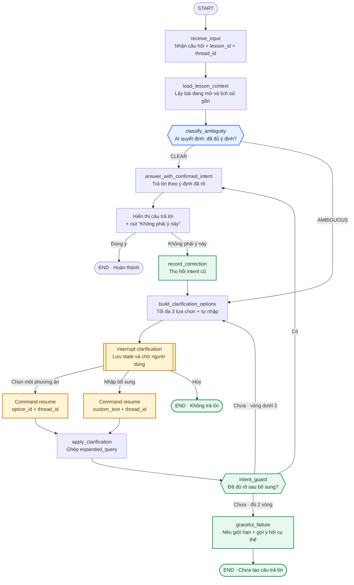

# Sơ đồ LangGraph — Tutor hỏi lại trước câu mơ hồ

## Quyết định AI duy nhất

`classify_ambiguity` quyết định câu hỏi hiện tại đã đủ ý định để trả lời hay phải hỏi lại. Hệ thống không sinh câu trả lời khi route là `AMBIGUOUS`.

## State tối thiểu

| Trường | Tác dụng |
|---|---|
| `thread_id` | Resume đúng phiên sau `interrupt` |
| `lesson_id` | Giữ ngữ cảnh bài đang mở |
| `question` | Câu hỏi ban đầu |
| `ambiguity_status` | `CLEAR` hoặc `AMBIGUOUS` |
| `ambiguity_reason` | Lý do cần hỏi lại để UI giải thích |
| `clarification_options` | Tối đa ba phương án có ngữ cảnh |
| `clarification_answer` | `option_id` hoặc nội dung tự nhập |
| `clarification_round` | Chặn vòng lặp sau tối đa hai lần |
| `confirmed_intent` | Ý định đã được người dùng xác nhận |
| `final_answer` | Chỉ tồn tại sau khi intent guard đạt |

## Nhánh demo CP2

1. Gõ `cho tôi link`.
2. `classify_ambiguity` trả `AMBIGUOUS` vì thiếu loại link.
3. UI hiện: repo đề bài 3B · repo nhóm · form checkpoint · Khác — tự nhập.
4. Graph `interrupt`, chưa sinh câu trả lời.
5. Người dùng chọn **repo nhóm**.
6. Client resume cùng `thread_id`; graph tạo intent đã xác nhận.
7. Tutor trả đúng repo nhóm.
8. Nếu bấm **Không phải ý này**, graph thu hồi intent và quay về lựa chọn.

## Phần mock và phần thật

- **CP2 mock:** kết quả `classify_ambiguity`, các lựa chọn và câu trả lời cuối được fixture hóa để chứng minh flow.
- **CP3 thật:** LangGraph checkpointer, `interrupt()`/`Command(resume=...)` và ít nhất một AI call tại `classify_ambiguity`.
